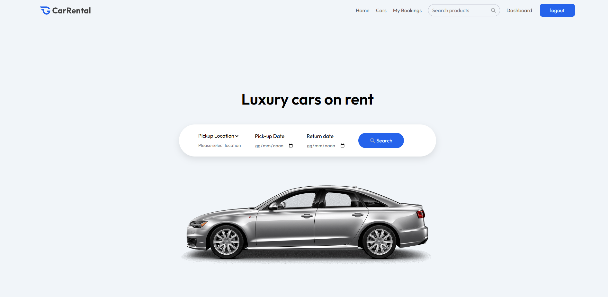
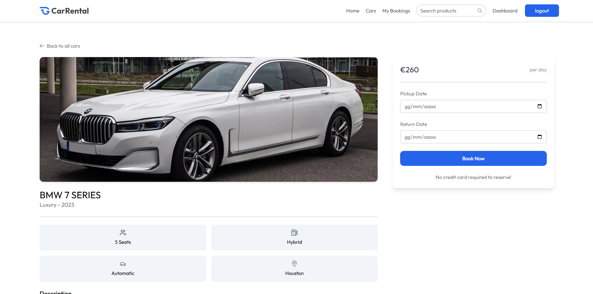

# 🚗 RentCars Fullstack (MERN + React)

**RentCars** is a fullstack luxury car rental application built with **MERN stack** for the backend and **React + Vite + TypeScript** for the frontend.  
It allows users to browse, book, and manage cars, while owners can add vehicles, view reservations, and track everything from a dashboard.  

---

✨ Features

🔑 Authentication & Roles: Secure JWT login, signup, role switching (User ↔ Owner)  
📅 Car Booking: Reserve cars with pricing, details, and availability  
🚘 Owner Dashboard: Add cars, manage bookings, and update availability status  
📊 Reservations Management: Owners can view all reservations and update booking status  
📈 Summary Dashboard: Global overview of cars, bookings, and revenue insights  
🖼️ Image Upload: Integrated with **ImageKit** for car image management  

---

🛠️ Tech Stack

- **Frontend**: React, Vite, TypeScript, Tailwind CSS, React Router DOM, Axios  
- **Backend**: Node.js, Express.js, MongoDB, Mongoose  
- **Authentication**: JWT + bcrypt  
- **Image Hosting**: ImageKit  
- **State Management**: Context API  

---

📂 Project Structure

.
├── client/            # Frontend (React + Vite + TS)
│   ├── src/           # Components, Pages, Hooks, Context, Utils
│   ├── vite.config.ts
│   └── package.json
├── backend/           # Backend (Node.js + Express + MongoDB)
│   ├── src/           # Config, Controllers, Routes, Models, Middleware
│   ├── server.js
│   └── package.json
└── README.md          # Fullstack documentation

---

⚙️ Environment Variables

## Client (`client/.env`)
VITE_CURRENCY=USD
VITE_BASE_URL=http://localhost:5000/api

## Backend (`backend/.env`)
MONGO_URL=mongodb+srv://<username>:<password>@cluster.mongodb.net/rentcars
PORT=5000
SECRET_KEY=your_secret_key_here
IMAGEKIT_PUBLIC_KEY=your_public_key
IMAGEKIT_PRIVATE_KEY=your_private_key
IMAGEKIT_END_POINT=https://ik.imagekit.io/your_project_id

---

🚀 Getting Started

Clone the repository:
git clone https://github.com/yourusername/rentcars-fullstack.git
cd rentcars-fullstack

### Backend Setup
cd backend
npm install
# create .env with variables above
npm run dev
# runs on http://localhost:5000/api

### Frontend Setup
cd client
npm install
# create .env with variables above
npm run dev
# runs on http://localhost:5173

---

📸 Screenshots

  
  

---

🔐 Authentication Flow

1. User registers or logs in  
2. JWT token is returned and stored in client  
3. User can browse cars and make bookings  
4. Owners can switch roles, add cars, view reservations, and update statuses  
5. Dashboard provides summary of activity  

---

Happy coding! 🚗✨
